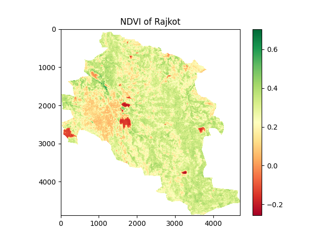
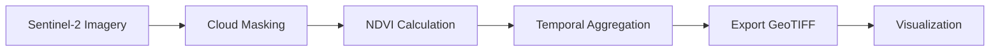
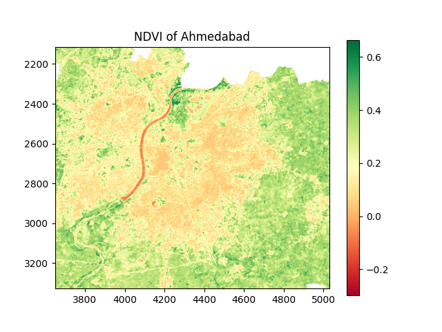

# 🌿 Monitoring Habitat Fragmentation Using Remote Sensing

[](https://www.python.org/)
[](https://earthengine.google.com/)
[](https://sentinel.esa.int/)
[](LICENSE)

> A geospatial analysis project monitoring urban habitat fragmentation in Gujarat, India using Sentinel-2 satellite imagery and NDVI calculation.



---

## 📋 Overview

This project analyzes habitat fragmentation patterns in **Rajkot** and **Ahmedabad** using remote sensing techniques. By calculating the Normalized Difference Vegetation Index (NDVI) from Sentinel-2 satellite imagery over a 3-year period (2020-2023), we identify and quantify the impact of urbanization on green spaces and ecosystem connectivity.

**Key Features:**
- 🛰️ Sentinel-2 satellite imagery processing
- ☁️ Automated cloud and snow masking
- 📊 NDVI calculation and temporal aggregation
- 🗺️ High-resolution vegetation mapping (10m resolution)
- 📈 Comparative urban fragmentation analysis

---

## 🎯 Objectives

1. Monitor vegetation health and distribution in urban environments
2. Calculate NDVI to assess green cover changes
3. Identify patterns of habitat fragmentation
4. Compare fragmentation intensity between major cities
5. Provide data-driven insights for urban planning

---

## 🛠️ Technologies Used

| Category | Tools |
|----------|-------|
| **Cloud Platform** | Google Earth Engine (GEE) |
| **Languages** | JavaScript (GEE API), Python |
| **Satellite Data** | Copernicus Sentinel-2 Surface Reflectance (L2A) |
| **Python Libraries** | `rasterio`, `matplotlib`, `numpy`, `geopandas` |
| **Data Format** | GeoJSON, GeoTIFF |

---

## 📊 Methodology

### NDVI Calculation

The **Normalized Difference Vegetation Index (NDVI)** measures vegetation health:

```
NDVI = (NIR - Red) / (NIR + Red)
```

Where:
- **NIR**: Near-Infrared reflectance (Band 8)
- **Red**: Red reflectance (Band 4)

### Workflow



1. **Data Acquisition**: Load Sentinel-2 L2A imagery from GEE
2. **Preprocessing**: Apply cloud/snow masking (>50% probability threshold)
3. **NDVI Calculation**: Compute using NIR and Red bands
4. **Temporal Aggregation**: Calculate 3-year mean NDVI
5. **Export**: Generate GeoTIFF files for analysis
6. **Visualization**: Create maps and statistical comparisons

---

## 📁 Project Structure

```
Habitate-Fragmentation/
├── Analysis/
│   ├── Rajkot_NDVI.tif           # NDVI GeoTIFF for Rajkot
│   └── AHEMDABAD_NDVI.tif        # NDVI GeoTIFF for Ahmedabad
├── Datasets/
│   ├── rajkot_boundary.geojson   # Study area boundary
│   └── ahemdabd_boundary.geojson # Study area boundary
├── Documentation/
│   ├── Monitoring_Habitat_Fragmentation_Remote_Sensing.pdf
│   └── Monitoring-Habitat-Fragmentation-in-Rajkot-Using-Remote-Sensing.pptx
├── Scripts/
│   ├── geodata_processing.js     # Google Earth Engine script
│   └── visualization.py          # Python visualization script
├── Visualization/
│   └── maps/                     # Generated NDVI maps
├── habitat_fragmentation_analysis.ipynb  # Main analysis notebook
└── README.md
```

---

## 🚀 Getting Started

### Prerequisites

```bash
# Python 3.8+
python --version

# Required Python packages
pip install rasterio matplotlib numpy geopandas
```

### Installation

1. **Clone the repository**
```bash
git clone https://github.com/yourusername/habitat-fragmentation.git
cd habitat-fragmentation
```

2. **Install dependencies**
```bash
pip install -r requirements.txt
```

3. **Open the Jupyter Notebook**
```bash
jupyter notebook habitat_fragmentation_analysis.ipynb
```

### Google Earth Engine Setup

1. Sign up for [Google Earth Engine](https://earthengine.google.com/)
2. Upload boundary GeoJSON files to GEE Assets
3. Update asset paths in `geodata_processing.js`
4. Run the script in GEE Code Editor

---

## 📈 Results

### Sample NDVI Maps

| Rajkot | Ahmedabad |
|--------|-----------|
|  |  |

### Key Findings

- **Urban Sprawl**: Both cities show significant habitat fragmentation
- **Vegetation Distribution**: Scattered green patches with urban cores
- **NDVI Range**: 0-0.8, indicating mix of bare land to dense vegetation
- **Fragmentation Impact**: Higher in Ahmedabad due to larger metropolitan area

---

## 🎓 Use Cases

- **Urban Planning**: Identify areas for green corridor development
- **Environmental Monitoring**: Track vegetation loss over time
- **Conservation**: Prioritize areas for habitat restoration
- **Research**: Academic studies on urban ecology
- **Policy Making**: Data-driven environmental policies

---

## 🔮 Future Enhancements

- [ ] Temporal trend analysis (2015-2025)
- [ ] Landscape fragmentation metrics (patch density, connectivity)
- [ ] Machine learning for land use classification
- [ ] Multi-city expansion across India
- [ ] Real-time monitoring dashboard
- [ ] Ground-truth validation with field surveys

---

## 📚 Resources

- [Google Earth Engine Documentation](https://developers.google.com/earth-engine)
- [Sentinel-2 User Guide](https://sentinel.esa.int/web/sentinel/user-guides/sentinel-2-msi)
- [NDVI Interpretation Guide](https://www.usgs.gov/landsat-missions/landsat-normalized-difference-vegetation-index)

---

## 👨‍💻 Author

**Manish Kumar Choudhary**

- 📧 Email: manishkumarchoudhary122450@marwadiuniversity.ac.in
- 💼 LinkedIn: [Your LinkedIn Profile]
- 🐙 GitHub: [Your GitHub Profile]

---

## 📄 License

This project is licensed under the MIT License - see the [LICENSE](LICENSE) file for details.

---

## 🙏 Acknowledgments

- **Google Earth Engine** for providing planetary-scale geospatial analysis platform
- **European Space Agency (ESA)** for Sentinel-2 satellite data
- **Marwadi University** for research support

---

## 📞 Contact

For questions, suggestions, or collaboration opportunities:
- Open an [Issue](https://github.com/yourusername/habitat-fragmentation/issues)
- Submit a [Pull Request](https://github.com/yourusername/habitat-fragmentation/pulls)

---

**⭐ If you find this project useful, please consider giving it a star!**
